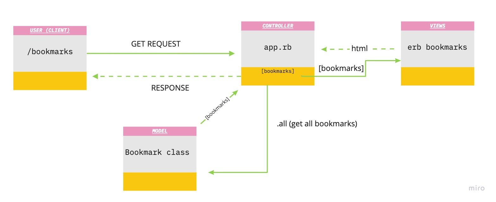

# Bookmark Manager

This code is intended as a supplementary guide for [bookmark manager](https://github.com/makersacademy/course/tree/master/bookmark_manager). The commits on master branch roughly correspond with the walkthroughs provided in the challenge.

## User Stories

```
As a time-pressed user 
so that I can go back to webpages that are of interest to me 
I want to be able to bookmark them and return a list of them 
```
```
As a time-pressed user
So that I can save a website
I would like to add the site's address and title to bookmark manager
```

### Domain Model


